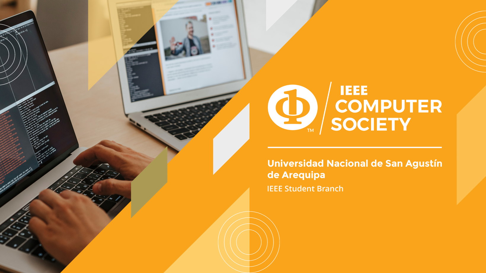

# MATERIAL IEEE CS UNSA

## Maquetación de Referencia 🎨
Maquetación en Figma de referencia: [Enlace Figma](https://github.com/ValentinaCham/ieee-cs-unsa-material)

Esta maquetación ofrece una referencia de como el equipo IEEE CS UNSA se imagina la página 😊 no es obligatorio seguirla pero se solicita las vistas de:
- Inicio
- Misión y Visión
- Eventos
- Equipo
Los colores a utilizar deben seguir la linea de branding del Capitulo Técnico IEEE Computer Society: [IEEE Computer Society Brand Identity & Graphic Style Guide](https://www.computer.org/about/ieee-computer-society-brand-guide)
## Especificación de Vistas
Para las vistas se tienen en consideración las siguientes especificaciones:
### Inicio
En el inicio se espera una vista introductoria de las demás vistas de la página, con un enlace respectivo a dichas vistas.
### Misión y Visión
La misión y visión correspondientes deben ir en alineación con las propuestas por el Capitulo IEEE COmputer Society general. Para redirigirse a la Página Oficial IEEE Computer Society hacer click [AQUÍ](https://www.computer.org/about?source=nav)
### Eventos
El branding elaborado para los eventos de la IEEE Computer Society de la Universidad Nacional de San Agustín de Arequipa se realiza en Canva, estando siempre adaptado en la medida de 1080px x 1080px
### Equipo
Actualmente el equipo IEEE CS UNSA se conforma de la Directiva General y de los Comités. En el apartado de recurso podrán encontrar las imagenes de las personas de nuestra directiva con una corta descripción. Demás actualizaciones que se realicen deberán ser posibles y adaptativas.
Enlace a la carpeta: 
## Concurso de Diseño de Página Web 2024
Las bases para el concurso están en el apartado: 

Uso de Contenido Libre de Derechos: Si decides incorporar imágenes o vectorizaciones en tu diseño, asegúrate de utilizar contenido que tenga los derechos correspondientes o que sea libre de derechos.

Responsivo: Tu diseño debe ser adaptable y ofrecer una excelente experiencia de usuario en diferentes dispositivos, desde computadoras de escritorio hasta dispositivos móviles.

Herramientas de Desarrollo: Recomendamos el uso de Angular, Vue, Svelte o React para el desarrollo de la página web estática. Esto facilitará su adaptación a la herramienta de hosting que tenemos disponible.

Derechos de Diseño: Los derechos del diseño creado seguirán perteneciendo a los desarrolladores correspondientes. No obstante, el Capítulo Estudiantil de IEEE CS UNSA otorgará reconocimiento a los diseñadores por su contribución. Se solicitará que se brinden detalles básicos del diseño sin comprometer su propiedad intelectual.

Inicio de Convocatoria: Viernes 16 de Febrero

Envío de trabajos (a través del Repositorio Remoto de Acceso Público): Desde el Lunes 4 de Marzo (12:00 pm) hasta el Viernes 8 de Marzo (10:00 am)

Presentación de Participantes y Selección del Jurado: Viernes 8 de Marzo (5:00 pm)

### ¡Es tu oportunidad de destacar en el mundo del diseño y desarrollo web! Participa en el Desafío Web y muestra tus habilidades al mundo. ¡Esperamos con entusiasmo ver tus creaciones!

