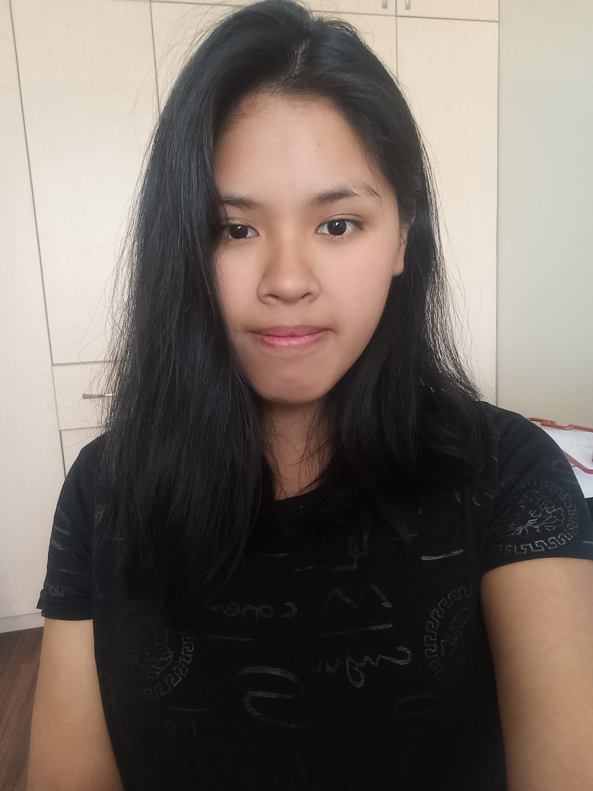
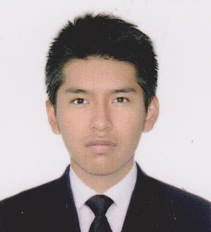
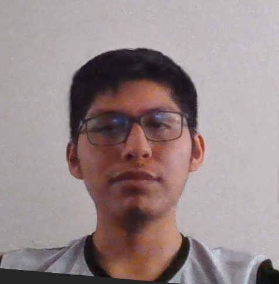
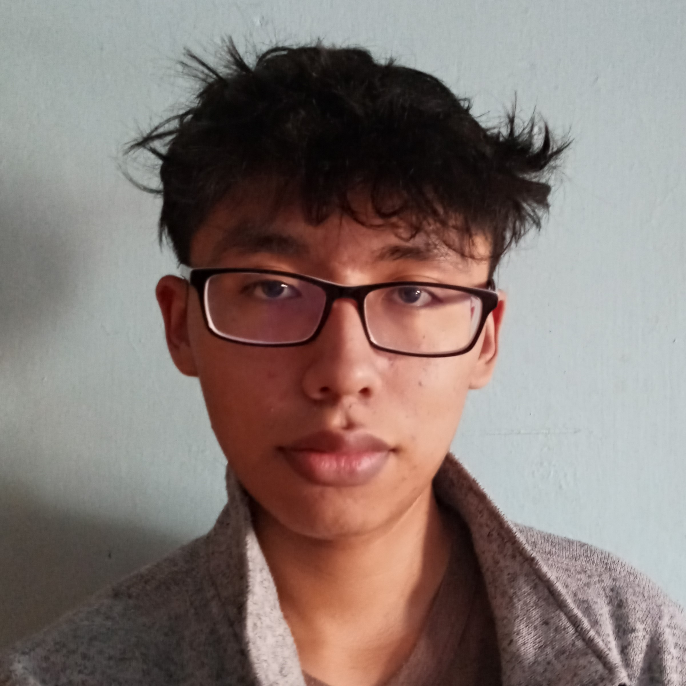

# EQUIPO 2024
El presente equipo se encargo el 2023 de poder realizar el envio de la solicitud de apertura tanto a la Rama Estudiantil IEEE UNSA, IEEE Sección Perú y Capitulo Tecnico IEEE Computer Society, logrando la apertura oficial el 13 de Noviembre del 2023 😃. Ello se logró gracias al apoyo de la Rama IEEE UNSA y de nuestra Faculty Sponsor, la Ingeniera Eveling Castro.
El equipo se conforma por
## 🏛️ Directiva
### 💻 **Chair**

Valentina Milagros Chambilla Perca

Estudiante de Septimo Ciclo de la Carrera Profesional de Ingeniería de Sistemas en la Universidad Nacional de San Agustín de Arequipa. Es una estudiante entusiasta en el campo de IoT y uso de Tecnologías en la Nube.
### 📊 **Vice Chair**

Rodrigo Alejandro Véliz Saihua

Estudiante de Septimo Ciclo de la Carrera Profesional de Ingeniería de Sistemas en la Universidad Nacional de San Agustín de Arequipa. Es una estudiante bastante centrado en el campo de Desarrollo Web, con experiencia freelancer en el campo de Desarrollo Web FrontEnd y FullStack.
### 📈 **Treasurer**

Frank's Javier Vilca Quispe

Estudiante de Septimo Ciclo de la Carrera Profesional de Ingeniería de Sistemas en la Universidad Nacional de San Agustín de Arequipa. Es una estudiante bastante centrado en el campo de Desarrollo Web y de Tecnologías de Despliegue y Servicios en la Nube. Estudiante que se centra actualmente en su capacitación AWS y en demás campos tecnológicos.
### 📖 **Secretary**

Antony Jacob Blanco Trujillo

Estudiante de Septimo Ciclo de la Carrera Profesional de Ingeniería de Sistemas en la Universidad Nacional de San Agustín de Arequipa. Es un estudiante con gran interes por los diversos campos, pero con mayor experiencia en el campo de Redes y de Despliegue de Páginas Web en Desarrollo BackEnd. Actual integrante del Centro de Investigación CiTeSoft de la UNSA.
### 📖 **Web Master**

Christian Raúl Mestas Zegarra

Estudiante de Tercer Ciclo de la Carrera Profesional de Ingeniería de Sistemas en la Universidad Nacional de San Agustín de Arequipa. Es un estudiante con un gran interes por Desarrollo BackEnd en Páginas Web y en Desarrollo de Videojuegos. Actual integrante del Centro de Investigación CiTeSoft de la UNSA.
## Comités de Trabajo

Actualmente se cuenta con 4 comités, pero aún no se ha designado un encargado general.
### Comité de Organización de Eventos y Desarrollo Profesional

Nombre de Lider de Comite

- Planificación y ejecución de eventos como charlas, conferencias y talleres.
- Facilitación de oportunidades de desarrollo profesional y sesiones de mentoría.
### Comité de Proyectos y Tecnología

Nombre de Lider de Comite

- Liderazgo en proyectos tecnológicos y hackatones.
- Colaboración en actividades prácticas para aplicar habilidades técnicas.
### Comité de Comunicaciones y Membresía

Nombre de Lider de Comite

- Gestión de la comunicación interna y externa del capítulo.
- Administración de redes sociales, sitio web y envío de boletines.
- Actividades de reclutamiento y orientación para nuevos miembros.
### Comité de Finanzas y Responsabilidad Social

Nombre de Lider de Comite

- Gestión del presupuesto del capítulo y búsqueda de patrocinadores.
- Organización de actividades de responsabilidad social y proyectos de voluntariado.
